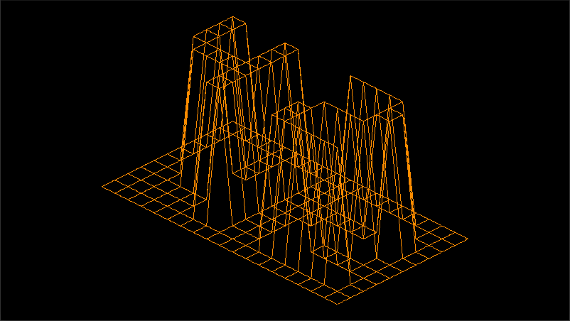
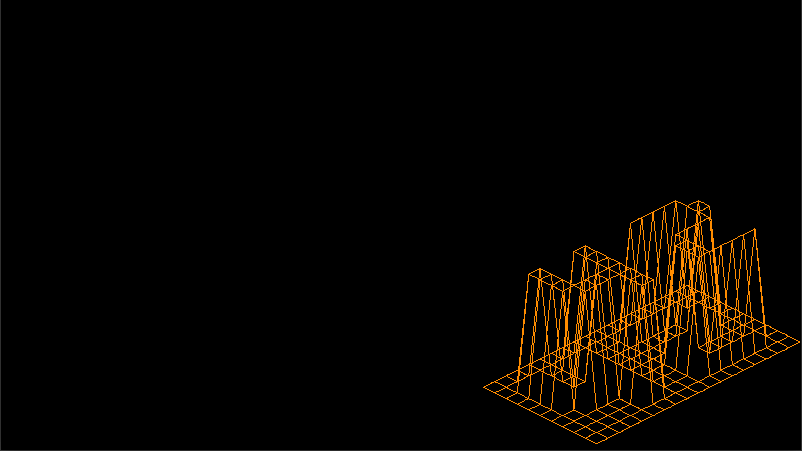
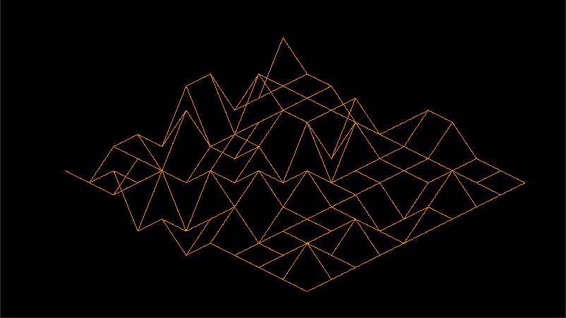
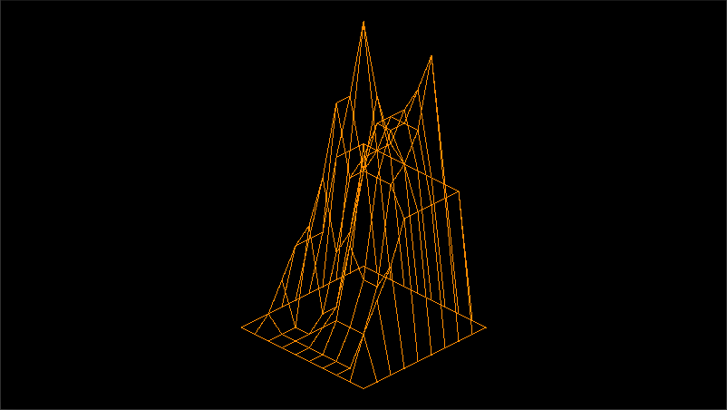

# FdF - Wireframe Renderer

This is a 3D wireframe renderer project created as part of the curriculum at Ecole 42 Paris. The goal is to take a map as input and create a graphical representation of it in relief.

The name FdF stands for "Fil de Fer" (wireframe in French), in reference to the graphical representation that uses wires to create a grid in relief.

The code is not provided as it's the rule of 42Seoul.

## Usage

The program takes a map file as input, which should be formatted as a grid of integers, with each integer representing the altitude of a point in the grid.

Here's an example of how to run the program:

```bash
./fdf maps/42.fdf
```
This will open a window displaying the wireframe representation of the map.

The program supports various features, such as rotation, translation and zooming. Here's how to use them: 

<div align="center">

| Move   | Rotate  | Zoom    | Close Window |
| :----: | :-----: | :-----: | :----------: |
| Arrows | A and D | W and S | Escape       |

</div>

## Screenshots

Here are some screenshots of the program in action:

<div align="center">
  
   
</div>

<div align="center">
  
   
</div>

## Acknowledgements

This project was created as part of the curriculum at Ecole 42 Paris. The graphics library used in this project is [MiniLibX](https://github.com/42Paris/minilibx-linux).
